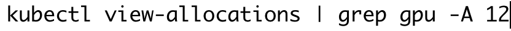

# cmlgpu

```
#podman rmi $(podman images -qa) -f
#podman system prune --all --force && podman rmi --all
export TMPDIR="/home/tmp/buildah"
buildah bud cdsw-julia.dockerfile
podman images
podman push 68f9494a07c docker-sandbox.infra.cloudera.com/mchisinevski/marcgpu:0.2
```





