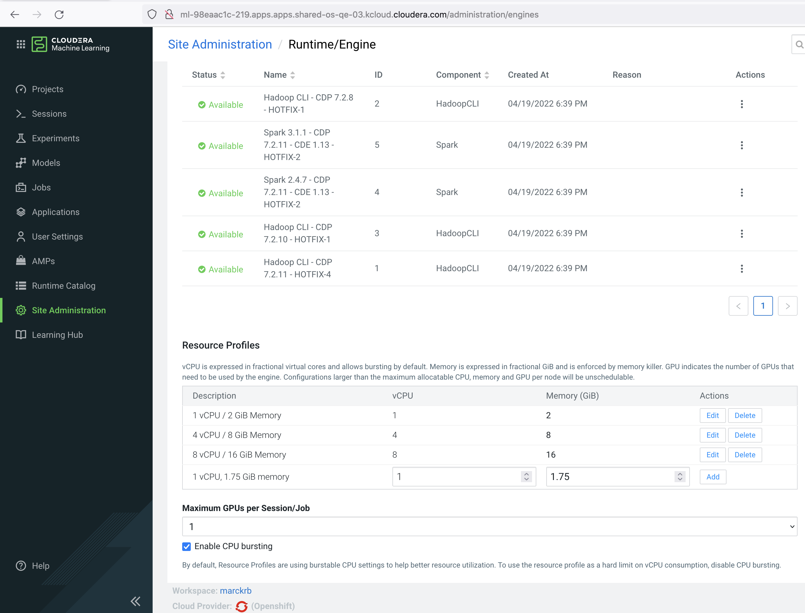
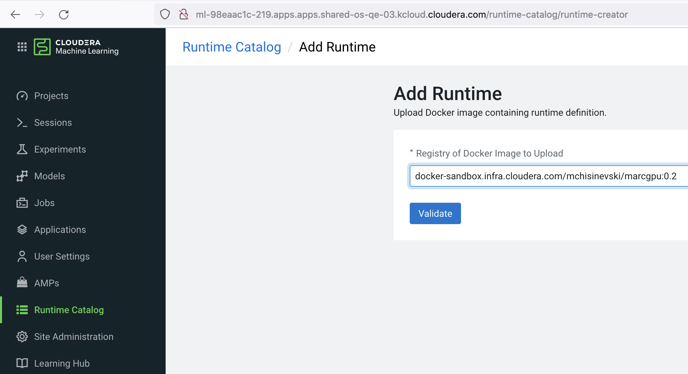
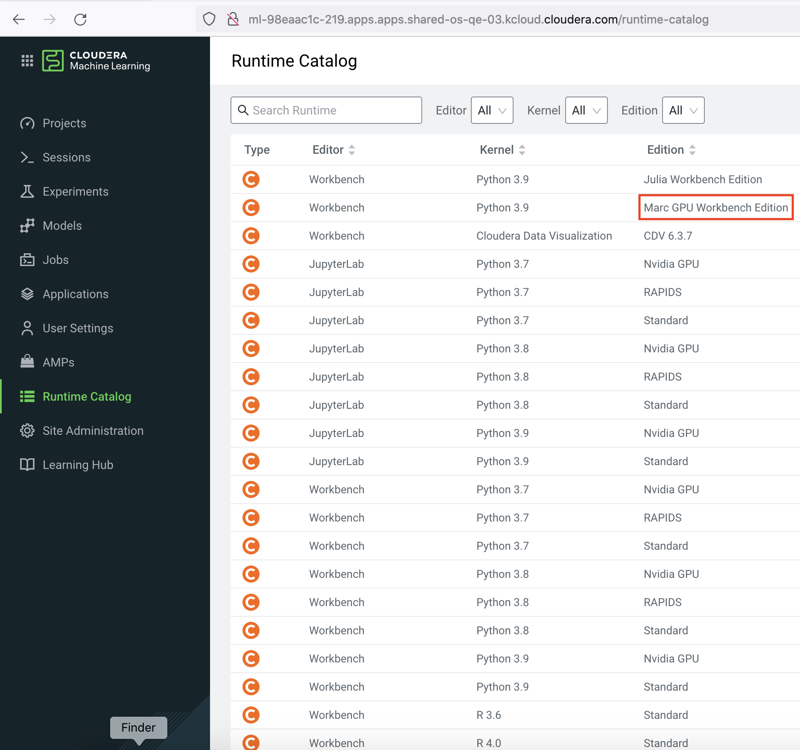
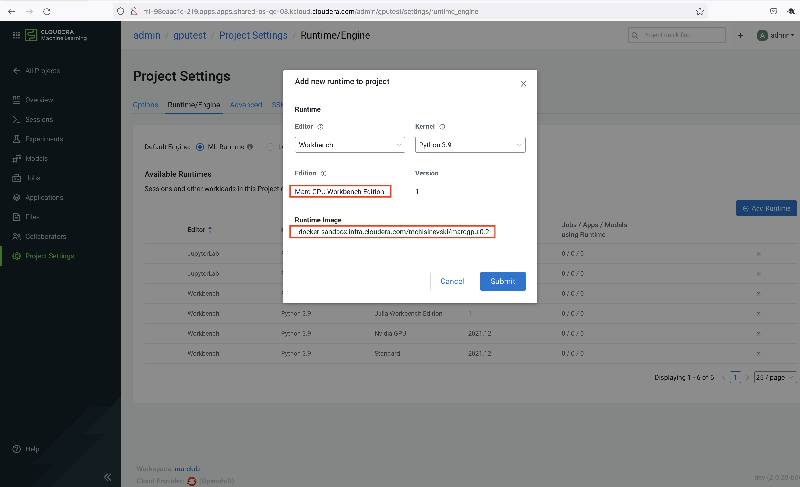
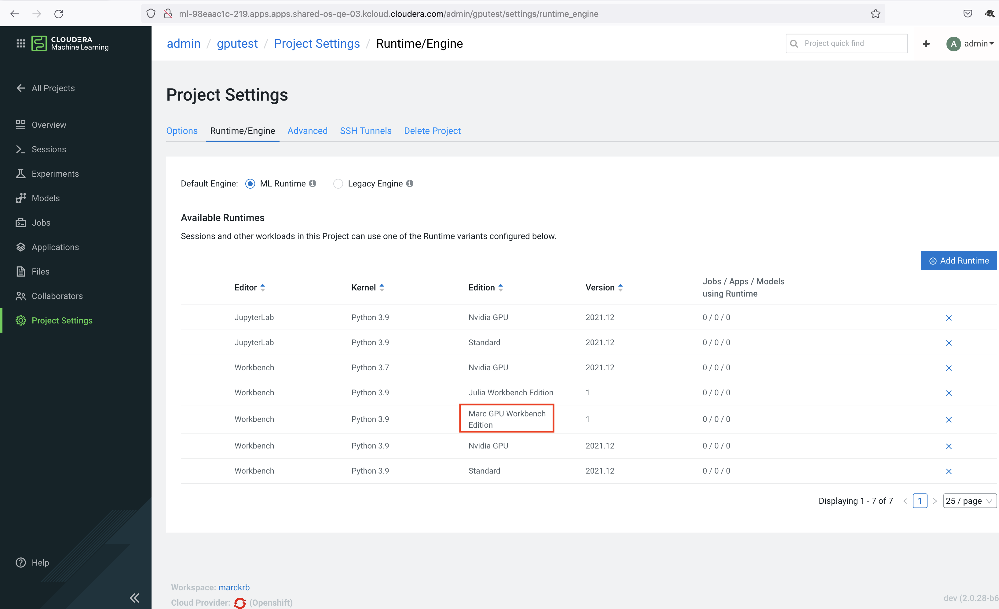
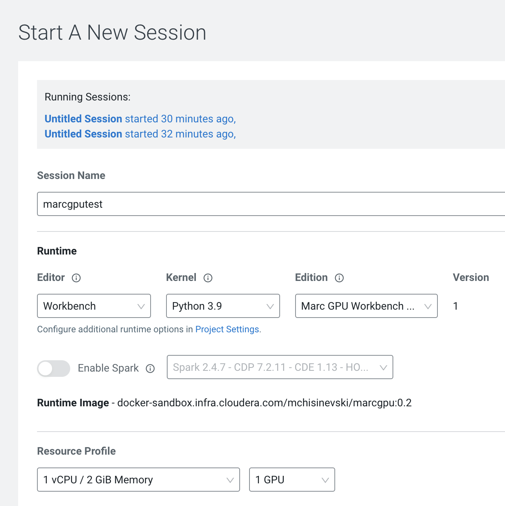
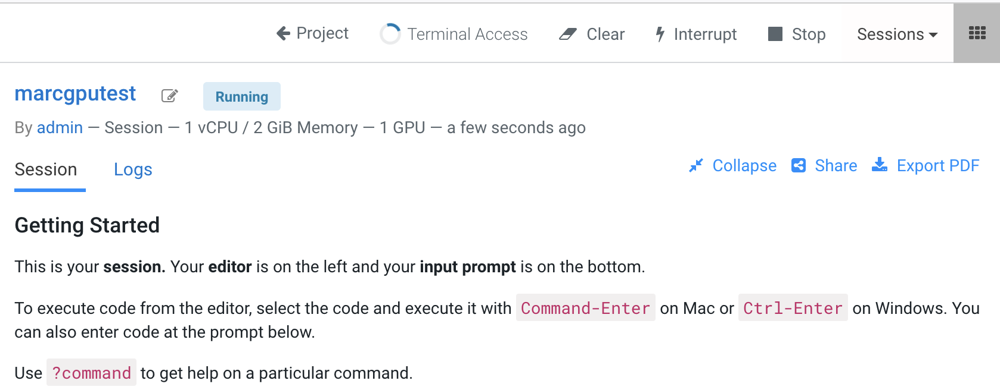
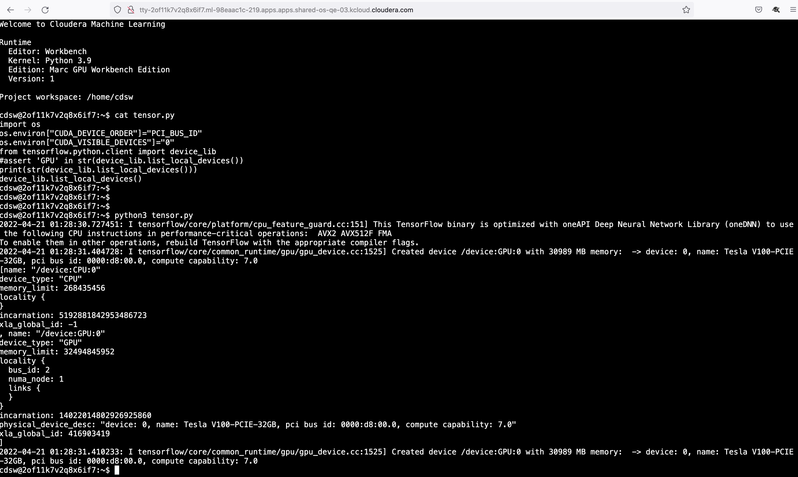
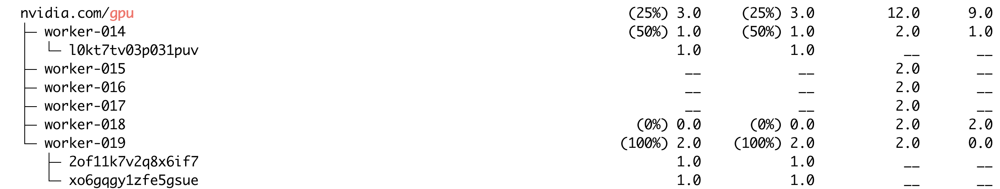

# OpenShift Bare Metal provisioning with NVIDIA GPU 

# Prerequisite checks to run before deploying and testing Cloudera Machine Learning

https://github.com/marcredhat/cmlgpu/blob/main/OpenShift%20Bare%20Metal%20provisioning%20with%20NVIDIA%20GPU.md

<br>

# Custom runtime with GPUs on CML Private Cloud 1.3.4


# What you will need
Access to https://archive.cloudera.com/ml-runtimes 


Current runtimes are described here:


https://archive.cloudera.com/ml-runtimes/2021.09.2/artifacts/repo-assembly.json 


Clean up existing images; the instructions below **delete all images** , make sure this is what you want

```
#podman rmi $(podman images -qa) -f
#podman system prune --all --force && podman rmi --all
```
<br>

Let's **create a custom CML runtime** based on docker.repository.cloudera.com/cloudera/cdsw/ml-runtime-workbench-python3.9-cuda:2021.12.1-b17

In the Dockerfile below, note that:
- we also install install **sklearn, tensorflow-gpu, keras and torch**
- we specify ENV ML_RUNTIME_EDITION="Marc GPU Workbench Edition" which is the name that will be displayed in CML

```
ML Runtime Metadata
Some of the metadata is not overwritable
ML_RUNTIME_EDITOR is overwritable - populates the Editor drop-down
ML_RUNTIME_EDITION is overwritable and required - populates the Edition drop-down
Recommended to change - cannot deploy an update ML Runtime with same metadata, 
there is some validation logic during the Add Runtime process
ML_RUNTIME_DESCRIPTION
ML_RUNTIME_SHORT_VERSION
ML_RUNTIME_FULL_VERSION
ML_RUNTIME_MAINTENANCE_VERSION
```

<br>

```
 cat cdsw-julia.dockerfile
FROM docker.repository.cloudera.com/cloudera/cdsw/ml-runtime-workbench-python3.7-standard:2022.11.1-b2

RUN apt-get update && apt-get install curl gzip

RUN apt-get update -y && apt-get upgrade -y && apt-get clean && rm -rf /var/lib/apt/lists/*
#Install Julia
RUN export J_VERSION=$(curl -s "https://api.github.com/repos/JuliaLang/julia/releases/latest" | grep -Po '"tag_name": "v\K[0-9.]+')
ENV JULIA_VERSION=$J_VERSION
RUN export J_M_VERSION=$(echo $JULIA_VERSION | grep -Po "^[0-9]+.[0-9]+")
ENV JULIA_MINOR_VERSION=$J_M_VERSION
RUN pip3 install scikit-learn tensorflow keras torch
# Override Runtime label and environment variables metadata
ENV ML_RUNTIME_EDITION="Marc GPU Workbench Edition" ML_RUNTIME_SHORT_VERSION="1" ML_RUNTIME_MAINTENANCE_VERSION="8" ML_RUNTIME_FULL_VERSION="1.8" ML_RUNTIME_DESCRIPTION="This runtime includes Julia"
LABEL com.cloudera.ml.runtime.edition=$ML_RUNTIME_EDITION com.cloudera.ml.runtime.full-version=$ML_RUNTIME_FULL_VERSION com.cloudera.ml.runtime.short-version=$ML_RUNTIME_SHORT_VERSION com.cloudera.ml.runtime.maintenance-version=$ML_RUNTIME_MAINTENANCE_VERSION com.cloudera.ml.runtime.description=$ML_RUNTIME_DESCRIPTION
```

<br>

Let's **build an image using the above Dockerfile and push it to a repository**.

```
export TMPDIR="/home/tmp/buildah"
buildah bud cdsw-julia.dockerfile
podman images
podman push 68f9494a07c docker-sandbox.infra.cloudera.com/mchisinevski/marcgpu:0.2
```

<br>

At Site Administration / Runtime / Engine
**ensure that Maximum GPUs per Session/Job is at least 1**



<br>

**Add our custom runtime to the Runtime Catalog**



<br>

**Check that our custom runtime is available in the Runtime Catalog**



<br>

**Add the custom runtime to a CML project**



<br>

**Check that the custom runtime is available to the CML project**



<br>

**Specify the number of GPUs required and start a CML session**



<br>

**CML session:**



<br>

Click on "Terminal access" then **use Tensorflow to list the GPUs available to our CML session/pod**



<br>

**Use the view-allocations kubectl plugin**

```
kubectl view-allocations | grep gpu -A 12
```

<br>



# Useful commands

https://github.com/marcredhat/cmlgpu/blob/main/usefulcommands.md
